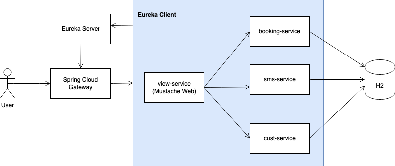
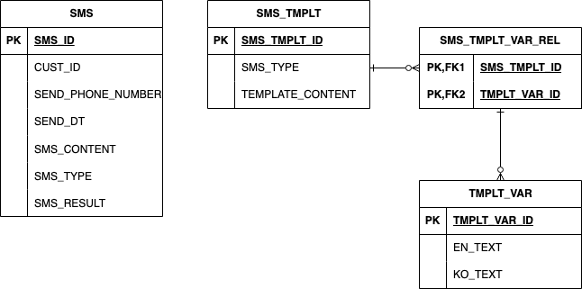

# 💌 OO-SMS (Object-Oriented SMS)

OO-SMS는 공연을 예매한 고객들에게 맞춤형 문자를 발송하기 위한 MSA 기반의 메시지 전송 시스템입니다.  
이 프로젝트는 객체지향적인 코드 설계와 MSA 구조의 실전 적용을 목표로 시작되었습니다.

---

## 🧩 주요 기능

- 고객 등록 및 수정
- 공연 등록 및 수정
- 고객의 공연 예매
- 고객 대상 문자 발송
- 문자 템플릿 및 템플릿 변수 관리

---

## 📚 API 문서 (Swagger)
프로젝트의 전체 API 명세는 아래 통합 Swagger 페이지에서 확인할 수 있습니다.

🔗 [OO-SMS 통합 Swagger UI 바로가기](https://jisu-shin.github.io/oo-sms-swagger-ui/)

---

## 🧱 기술 스택

- Java 17, Spring Boot 3.3
- Spring Cloud (Gateway, Config Server, Eureka) 
- Spring Data JPA, QueryDSL,  H2 Database
- Mustache (웹 프론트)
- Docker, Docker Compose 
- Swagger (OpenAPI 기반 API 문서 자동 생성)

---

## 🏗️ 아키텍처

### 전체 구성도

 <!-- ← 생성한 아키텍처 다이어그램 이미지 위치에 맞게 -->

각 서비스는 별도 레포지토리로 관리됩니다.

| 서비스명            | 설명                   | 레포지토리 링크                                     |
|-----------------|----------------------|----------------------------------------------|
| config-server   | 공통 설정 관리 서버          | (링크 추가 예정)                                   |
| eureka-server   | 서비스 디스커버리 서버         | (링크 추가 예정)                                   |
| gateway         | API Gateway 서버       | https://github.com/Jisu-Shin/SCG             |
| sms-service     | SMS 예약 발송 도메인 서비스    | https://github.com/Jisu-Shin/jisutudy        |
| cust-service    | 고객 관리 도메인 서비스        | https://github.com/Jisu-Shin/cust-service    |
| booking-service | 예약 관리 도메인 서비스        | https://github.com/Jisu-Shin/booking-service |
| view-service    | 웹 페이지 (Mustache) 서비스 | https://github.com/Jisu-Shin/view-service    |


---

## 🐳 Docker Compose로 실행하기

OO-SMS 프로젝트는 Docker Hub에 등록된 이미지를 기반으로 Docker Compose로 실행합니다

### 1. Docker Compose 파일 준비

- `docker-compose.yml` 파일을 다운로드합니다.

### 2. Docker Compose로 실행

```bash
docker-compose up -d
```

---

## 🛢️ SMS 도메인 DB 모델링

SMS 서비스는 MSA 구조 내 하나의 통합 데이터베이스를 사용하며,  
다른 도메인(고객, 예약 등)과는 약결합(Loose Coupling)된 형태로 서비스 단위만 분리하여 설계되었습니다.

### 📋 ERD

 <!-- ← ERD 이미지 저장 경로 -->